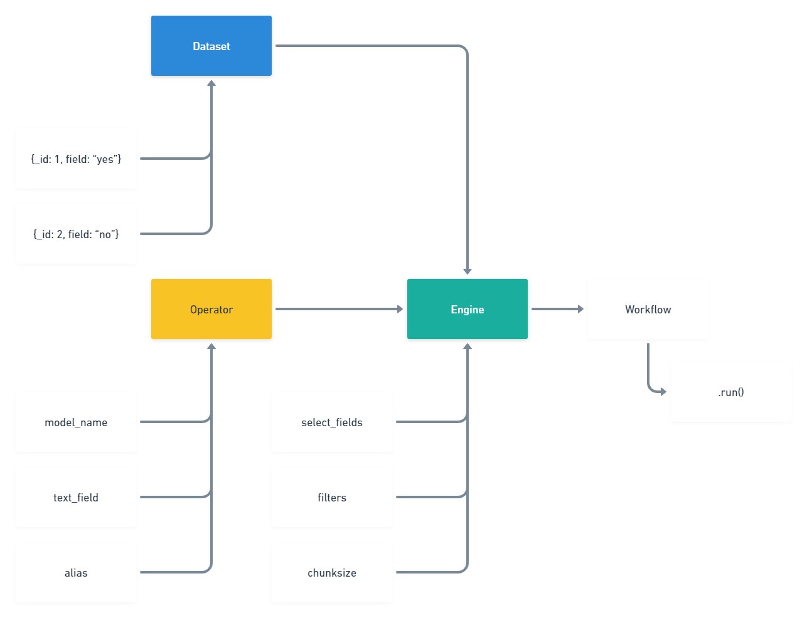

# Relevance Workflows Core

Below is a hierarchy diagram for all the moving parts of a workflow.



## 🛠️ Installation

Fresh install

```{bash}
pip install RelevanceAI-Workflows-Core
```

to upgrade to the latest version

```{bash}
pip install --upgrade RelevanceAI-Workflows-Core
```

## 🏃Quickstart

To get started, please refer to the example scripts in `scripts/`

```python

import random
from workflows_core.api.client import Clien
from workflows_core.engine.stable_engine import StableEngine
from workflows_core.workflow.helpers import decode_workflow_token
from workflows_core.workflow import Workflow
from workflows_core.operator.abstract_operator import AbstractOperator
from workflows_core.utils.random import Document

class RandomOperator(AbstractOperator):
    def __init__(self, upper_bound: int=10):
        self.upper_bound = upper_bound

    def transform(self, documents):
        for d in documents:
            d['random_number'] = random.randint(0, self.upper_bound)


client = Client()
ds = client.Dataset("sample_dataset")
operator = RandomOperator()

engine = StableEngine(
    dataset=ds,
    operator=operator,
    chunksize=10,
    filters=[],
)
workflow = Workflow(engine)

workflow.run()
```

## Workflow IDs and Job IDs

Workflows have Workflow IDs such as sentiment  - for example:
sentiment.py is called sentiment and this is how the frontend triggers it.
Workflow Name is what we call the workflow like Extract Sentiment .
Each instance of a workflow is a job and these have job_id so we can track their status.

## Engine Selection

### StableEngine

This the safest and most basic way to write a workflow. This engine will pull `chunksize`
number of documents, transform them according to the transform method in the respective operator
and then insert them. If `chunksize=None`, the engine will attempt to pull the entire dataset
transform the entire dataset in one go, and then reinsert all the documents at once. Batching is limited
by the value provided to `chunksize`.

### InMemoryEngine

This Engine is intended to be used when operations are done on the whole dataset at once.
The advantage this has over `StableEngine` with `chunksize=None` is that the pulling and
pushing documents is done in batch, but the operation is done in bulk. With `StableEngine`,
this would have involved extremely large API calls with larger datasets.

### How to release 

To cut a release, go to "Releases" and create a new version from `main` branch.
