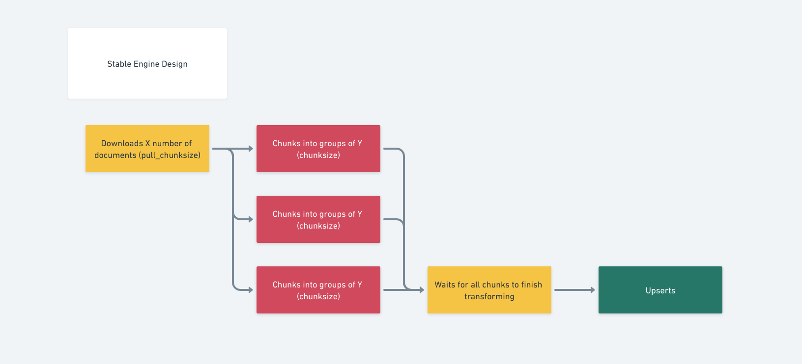

# Stable Engine 

The **************************stable engine************************** inside Relevance Workflows Core is intended to provide a way for developers to not have to worry about hammering the server.

The core focuses with this are: 

1. 502 Gateway errors happen when there is a lot of requests being made at the same time. This is even more so when there are 
2. Developers/data scientists can still focus on optimizing their ******************transform****************** function without having to worry about dealing with payloads/management upserts - knowing that their transform function will still work.

